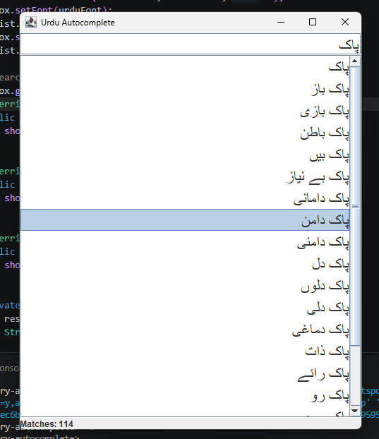

# Urdu Dictionary Autocomplete

Search-as-you-type autocomplete for Urdu, built in plain Java with a **Trie (prefix tree)**. It loads about 149,000 Urdu words and phrases and shows matching suggestions instantly as you type.



## Features

- Autocomplete over 149,466 Urdu words and phrases
- Search-as-you-type window with right-to-left layout for Urdu
- Shows the first 20 suggestions and the total number of matches
- Handles multi-word phrases such as `پاک دامن`
- No external libraries, only the Java standard library

## How to run

Requires **Java 17 or newer**.

**In VS Code:** open the project folder, open `SearchWindow.java`, and click **Run** above `main`.

**From the command line:**

```bash
git clone https://github.com/chander-kumar-dev/urdu-dictionary-autocomplete.git
cd urdu-dictionary-autocomplete
javac -encoding UTF-8 *.java
java SearchWindow
```

Type an Urdu prefix into the search box, for example `پاک`. To type Urdu on Windows, add the Urdu keyboard in **Settings → Time & language → Language & region** and switch with **Windows key + Space**, or paste text into the box.

## How it works

A Trie stores words letter by letter. Words that start with the same letters share the same path, so finding all words for a prefix does not require scanning the whole dictionary.

```text
root
 └── پ
      └── ا
           └── ک  ● پاک
                ├── س ── ت ── ا ── ن  ● پاکستان
                └── ی ── ز ── ہ  ● پاکیزہ
```

`●` marks a node where a complete word ends.

When you type a prefix:

1. `searchNode()` walks down the Trie one letter at a time to the node for the prefix.
2. `collectWords()` visits every node below it and collects the complete words.
3. The window shows the first 20 results and the total count.

| Operation | Cost |
|---|---|
| Insert a word of length L | `O(L)` |
| Find the node for a prefix of length L | `O(L)` |
| Collect matches | Grows with the number of matching words |

## Project structure

| File | Responsibility |
|---|---|
| `AutocompleteTrie.java` | Inserting words, finding a prefix, collecting matches |
| `TrieNode.java` | One node of the Trie and its child nodes |
| `DictionaryLoader.java` | Reads the word list from `urdu-words.txt` as UTF-8 |
| `SearchWindow.java` | The search window (Java Swing) |
| `urdu-words.txt` | The word list, one entry per line |

## Why a window instead of a terminal

The first version read input from the terminal. Windows terminals corrupt Urdu keyboard input before it reaches Java, so a typed `پاک` arrived as `?` and nothing matched. Standard windows handle Urdu correctly, so the project now uses a small Swing window instead.

## Known limitations

- **Letter variants are not normalized.** Urdu and Arabic keyboards produce different characters for letters that look the same (for example `ی` and `ي`, `ک` and `ك`). A word typed with the Arabic variant will not match.
- **All matches are collected before limiting.** A one-letter prefix collects thousands of words and then shows 20. It is still fast at this size, but stopping early would scale better.
- **No ranking.** Results appear in character order, not by how common a word is.

## Roadmap

- [ ] Normalize Arabic letter variants to their Urdu forms
- [ ] Stop collecting once the result limit is reached
- [ ] Rank suggestions by word frequency
- [ ] Unit tests with JUnit
- [ ] C# / .NET version

## Data

`urdu-words.txt` contains 149,466 Urdu words and phrases, compiled from publicly available Urdu word lists.

## License

The code is released under the [MIT License](LICENSE).

## Author

**Chander Kumar** · [GitHub](https://github.com/chander-kumar-dev) · [LinkedIn](https://www.linkedin.com/in/chander-kumar-dev)